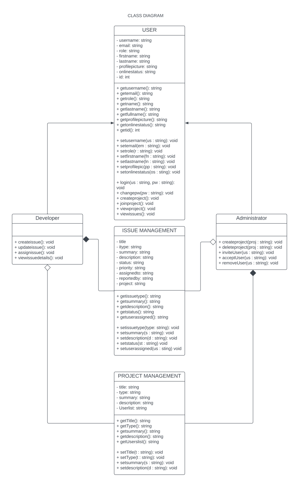
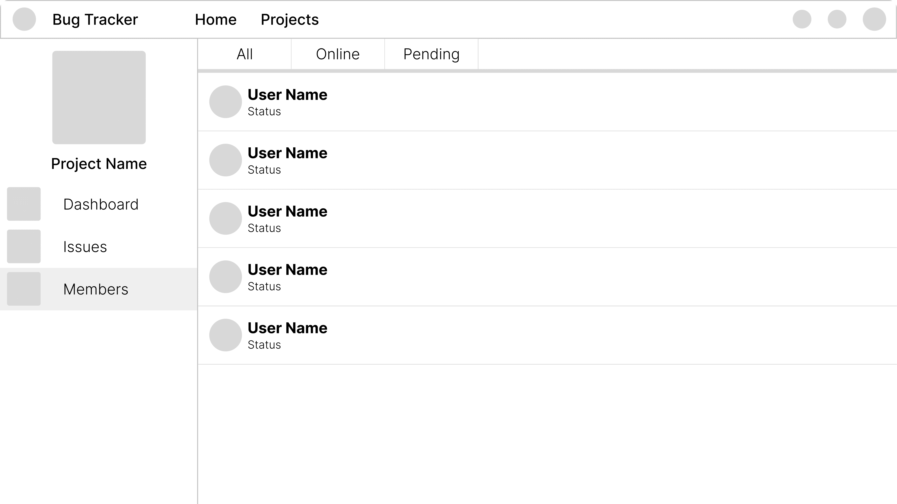

# BugTracker

## Design Phase
*Class Diagram*

**Summary**
* User
* Developer
* Administrator
* Issue Management
* Project Management

*Use Case Diagram*

**Summary**
* User
* Bug Tracker Database
* Login
* Register
* Create Project
* Join Project
* Issues
* Report Issue
* Assign Issue
* Update Issue

*Database Schema*

**Summary**
* User Auth
* User
* User Roles
* Role
* Project
* Project members
* Issue
* Comments

*User Interface*

  
  
  
  
  
  
  
  
  
  
  
  
  

## Production Phase
